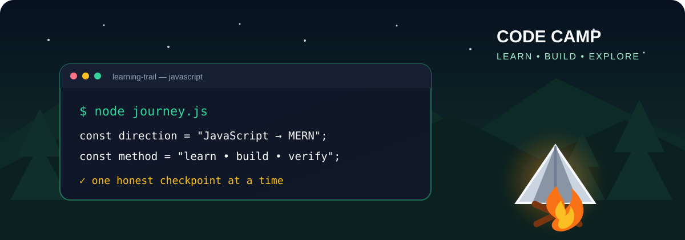

<p align="center">
  
</p>

<h1 align="center">🏕️ Eloquent JavaScript Learning Journey</h1>

<p align="center">
  <strong>From JavaScript foundations to MERN development—one honest, verified checkpoint at a time.</strong>
</p>

<p align="center">
  
  
  
  
</p>

> **Code is the trail. Curiosity is the compass. Verified practice is how I move forward.**

This repository documents a real student journey through *Eloquent JavaScript, Fourth Edition* and practical MERN development. It includes exercises, experiments, school briefs, presentations, mistakes, mentor feedback, concept notes, and the checks used to confirm progress.

It is not a polished collection of copied solutions. It is a transparent record of learning: predict, attempt, run, compare, correct, and explain.

Built for someone who enjoys two kinds of exploration: opening a code editor and heading into the outdoors. 🌲💻

## 🏕️ Current campsite

**Repository checkpoint:** 2026-10-10

| Trail | Current position | Status |
| --- | --- | --- |
| 📖 Book path | Chapter 4 — Data Structures: Objects and Arrays | 🟡 In progress |
| 📋 School brief | Sprint 2 — Brief 2 with Maroua | 🟡 In progress |
| 🎯 Current mission | Understand API takeover and non-regression | 🟡 Exercise ready |
| 🔐 Backend focus | Node.js, Express, MongoDB, and JWT authentication | 🔁 Learning and verification |
| 🎤 Presentation | JavaScript data structures | 🔁 Final placement and rehearsal needed |

The next checkpoint is to complete the [non-regression quick exercise](./workstreams/sprints/sprint-2/briefs/brief-2/exercises/api-takeover-non-regression.md) and explain the idea in one sentence.

For the full evidence, open [PROGRESS.md](./PROGRESS.md). For the latest handoff, open [sessions/CURRENT.md](./sessions/CURRENT.md).

## 🧭 Choose your trail

| If you want to... | Follow this path |
| --- | --- |
| See the verified learning situation | [Learning progress](./PROGRESS.md) |
| Get a complete assistant dashboard | Say **`give me situation`** |
| Follow the 21-chapter book roadmap | [Learning plan](./LEARNING_PLAN.md) |
| Explore book exercises and examples | [Chapter trail](./chapters/) |
| See presentations, live coding, and school briefs | [Applied workstreams](./workstreams/) |
| Resume from the latest checkpoint | [Current session](./sessions/CURRENT.md) |
| Review reusable JavaScript explanations | [Concept field notes](./notes/concepts/) |
| Understand the repository workflow | [Git workflow](./docs/GIT_WORKFLOW.md) |
| Collaborate with an AI assistant | [Shared agent guide](./AGENTS.md) |

## 🗺️ How the journey works

Every learning checkpoint follows the same trail:

```text
Read → Predict → Attempt → Run → Compare → Explain → Record
```

1. **Read** one focused concept or requirement.
2. **Predict** the result before running the code.
3. **Attempt** the exercise personally.
4. **Run** a relevant check.
5. **Compare** the behavior with the requirement.
6. **Explain** what worked, what failed, and why.
7. **Record** only progress supported by evidence.

> 💡 AI is used as a mentor and reviewer—not as a replacement for the learner's first attempt.

## 🧩 MERN compass

The book supplies the JavaScript foundation. School projects show where that foundation is used in real applications.

| Direction | Current evidence | Status |
| --- | --- | --- |
| **MongoDB** | Models, relationships, enrollment, and persistence concepts | 🟡 More runtime checks needed |
| **Express** | Routes, controllers, views, middleware, and API flows | 🟡 Active practice |
| **React** | No verified learning checkpoint yet | ⬜ Not started |
| **Node.js** | Server-side JavaScript, modules, HTTP, JWT, and testing plans | 🟡 In progress |

## 🎒 What is inside the backpack?

- **Book learning** — chapter notes, examples, exercises, and experiments.
- **Applied learning** — presentations, live-coding sessions, sprints, and briefs.
- **Concept notes** — short explanations connected to genuine book foundations.
- **Visual learning** — reviewed diagrams, concept cards, and technical flows.
- **Progress evidence** — passed checks, failed checks, feedback, and next actions.
- **Session continuity** — clear handoffs so another tool can continue safely.

## 🗂️ Repository map

```text
.
|-- README.md                 # The public trailhead
|-- LEARNING_PLAN.md          # The complete book route
|-- PROGRESS.md               # Verified learning dashboard
|-- AGENTS.md                 # Shared mentoring and repository rules
|-- Eloquent_JavaScript.pdf   # Local book source; never modified
|-- chapters/                 # The chapter-by-chapter learning path
|-- workstreams/              # Presentations, live coding, and school briefs
|-- notes/                    # Shared concepts, questions, and vocabulary
|-- sessions/                 # Current handoff and milestone history
|-- templates/                # Reusable learning structures
|-- docs/                     # Git, integration, and repository guidance
`-- playground/               # Small experiments without a permanent home
```

The two main routes are intentionally separate:

- [`chapters/`](./chapters/) answers **“What am I learning from the book?”**
- [`workstreams/`](./workstreams/) answers **“Where am I applying it?”**

## 🚀 Start exploring

### Requirements

- [Git](https://git-scm.com/) for cloning and version control.
- [Node.js](https://nodejs.org/) for running JavaScript exercises.
- A code editor such as Visual Studio Code, Cursor, or another editor you enjoy.

### Clone the repository

```bash
git clone https://github.com/Mehdi-133/leloquent-js-llearning.git
cd leloquent-js-llearning
```

### Check a JavaScript exercise

Read the nearest `README.md` first, then use Node.js when the exercise is self-contained:

```bash
node --check path/to/exercise.js
node path/to/exercise.js
```

Some workstreams have their own setup or belong to a separate project repository. Their local README explains the correct environment and verification steps.

## 🚦 Honest status language

| Marker | Meaning |
| --- | --- |
| ✅ **Complete** | The required behavior or understanding was verified |
| 🟡 **In progress** | Work has started, but evidence is still incomplete |
| 🔁 **Review needed** | An attempt exists and a specific correction remains |
| ⬜ **Not started** | No saved, verified attempt exists yet |

Writing code is not enough to mark an exercise complete. The behavior must run correctly, and the learner must be able to explain it.

## 🤝 Working on the trail

Before changing an area:

1. Read the nearest `README.md`.
2. Check [sessions/CURRENT.md](./sessions/CURRENT.md).
3. Preserve learner-owned attempts and unrelated changes.
4. Keep the work small and focused.
5. Run the relevant checks.
6. Record only verified progress.
7. Follow [docs/GIT_WORKFLOW.md](./docs/GIT_WORKFLOW.md) before committing.

The files in this repository are the public source of truth. Private Notion and calendar tools may mirror selected information, but they are not required to understand or continue the journey.

## 📖 Learning source

The chapter order and book foundations come from *Eloquent JavaScript, Fourth Edition* by Marijn Haverbeke. The local [`Eloquent_JavaScript.pdf`](./Eloquent_JavaScript.pdf) is consulted for learning and should not be edited, replaced, or redistributed separately without checking its original licensing terms.

---

<p align="center">
  <strong>🌲 Keep exploring. Keep building. Leave every campsite—and every codebase—better than you found it.</strong>
</p>
