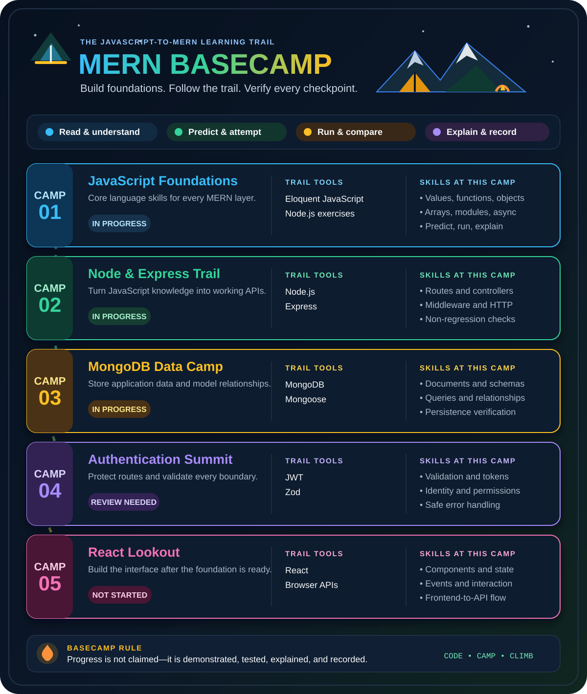
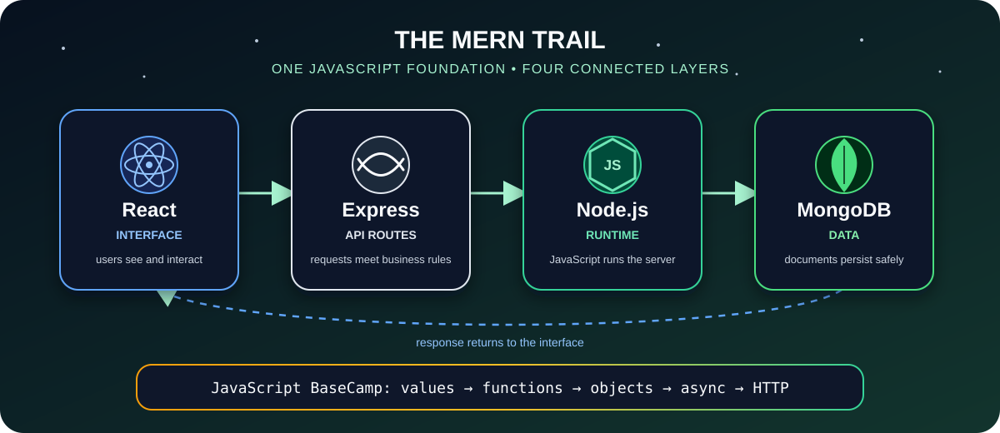

<p align="center">
  
</p>

<h1 align="center">🏕️ MERN BaseCamp</h1>

<p align="center">
  <strong>A public JavaScript-to-MERN learning expedition built on honest practice, visual notes, and verified progress.</strong>
</p>

<p align="center">
  
  
  
  
</p>

> **The campsite is where I prepare. The trail is where I practise. The summit is the developer I am becoming.**

## 🌲 Welcome to BaseCamp

**MERN BaseCamp** is my real learning workspace for becoming a stronger JavaScript and full-stack developer. The path begins with *Eloquent JavaScript, Fourth Edition* and continues through practical MongoDB, Express, React, and Node.js work.

This repository keeps the complete journey visible:

- 📖 book concepts and chapter exercises;
- 🧪 predictions, attempts, checks, mistakes, and corrections;
- 📋 school briefs, workshops, live coding, and presentations;
- 🧠 activity-owned notes connected to real requirements;
- 🖼️ visual explanations, diagrams, and learning maps;
- ✅ progress supported by evidence instead of optimistic guesses.

It is not a collection of copied solutions. It is a trail log of learning to **predict, build, test, explain, and improve**.

## 🧭 Current expedition

**Repository checkpoint:** 2026-10-10

| Trail | Current position | Honest status |
| --- | --- | --- |
| 📖 Book foundation | Chapter 4 — Data Structures: Objects and Arrays | 🟡 In progress |
| 📋 School project | Sprint 2 — Brief 2 with Maroua | 🟡 In progress |
| 🎯 Current mission | API takeover and non-regression | 🟡 Exercise ready |
| 🔐 Backend camp | Node.js, Express, MongoDB, and JWT | 🔁 Learning and verification |
| 🎤 Presentation trail | JavaScript data structures | 🔁 Visual placement and rehearsal needed |
| ⚛️ React trail | No verified checkpoint yet | ⬜ Not started |

### 🚀 Next trail marker

Complete the [non-regression quick exercise](./workstreams/sprints/sprint-2/briefs/brief-2/exercises/api-takeover-non-regression.md), then explain **non-regression** in one clear sentence.

For the complete evidence, open [PROGRESS.md](./PROGRESS.md). To resume the latest work, open [sessions/CURRENT.md](./sessions/CURRENT.md).

## 🗺️ The MERN trail

<p align="center">
  
</p>

The acronym says **MongoDB, Express, React, Node.js**. In a real request, the layers cooperate. The diagram is a learning map: Express handles API routes while running inside the Node.js runtime, MongoDB stores the data, and the response returns to React.

| Camp station | Responsibility | Learning evidence |
| --- | --- | --- |
| **MongoDB** | Persist application documents and relationships | 🟡 Models and enrollment concepts need more runtime checks |
| **Express** | Route requests through controllers and middleware | 🟡 Active API and authentication practice |
| **React** | Build the interface users see and interact with | ⬜ No verified checkpoint yet |
| **Node.js** | Run JavaScript on the server | 🟡 Modules, HTTP, JWT, and API work in progress |

> 🧠 **BaseCamp principle:** MERN is not four disconnected tools. JavaScript foundations connect the entire journey.

## 🔥 How I learn here

Every checkpoint follows the same camp routine:

```text
Read → Predict → Attempt → Run → Compare → Explain → Record
```

1. **Read** one focused concept or requirement.
2. **Predict** the result before running the code.
3. **Attempt** the exercise personally.
4. **Run** the smallest meaningful check.
5. **Compare** the behavior with the requirement.
6. **Explain** what worked, what failed, and why.
7. **Record** only progress supported by evidence.

> 💡 AI joins this camp as a mentor and reviewer—not as a replacement for my first attempt.

## 🧭 Choose your route

| If you want to... | Open this trail |
| --- | --- |
| See my verified learning situation | [PROGRESS.md](./PROGRESS.md) |
| Follow the complete 21-chapter roadmap | [LEARNING_PLAN.md](./LEARNING_PLAN.md) |
| Explore book exercises and experiments | [chapters/](./chapters/) |
| Review briefs, presentations, and live coding | [workstreams/](./workstreams/) |
| Continue from the latest checkpoint | [sessions/CURRENT.md](./sessions/CURRENT.md) |
| Understand the collaboration rules | [AGENTS.md](./AGENTS.md) |
| Review the Git workflow | [docs/GIT_WORKFLOW.md](./docs/GIT_WORKFLOW.md) |

You can also ask the learning mentor: **`give me situation`**.

## 🎒 What is in the backpack?

- **Book trail** — chapter notes, examples, exercises, and experiments.
- **Applied trail** — presentations, live-coding sessions, sprints, and briefs.
- **Concept camps** — focused lessons and review notes owned by the activity that needs them.
- **Visual maps** — reviewed diagrams, concept cards, flows, and comparison charts.
- **Evidence log** — passed checks, failed checks, feedback, and exact next actions.
- **Session compass** — a current handoff that helps every tool continue safely.

## 🗂️ Repository map

```text
.
|-- README.md                 # The public BaseCamp trailhead
|-- LEARNING_PLAN.md          # The complete Eloquent JavaScript route
|-- PROGRESS.md               # Verified learning dashboard
|-- AGENTS.md                 # Shared mentoring and repository rules
|-- Eloquent_JavaScript.pdf   # Local book source; never modified
|-- chapters/                 # Chapter-by-chapter JavaScript foundations
|-- workstreams/              # Briefs, presentations, and live coding
|-- sessions/                 # Current handoff and milestone history
|-- templates/                # Reusable learning structures
|-- docs/                     # Workflow guidance and visual assets
`-- playground/               # Small experiments without a permanent home
```

The repository keeps two routes separate:

- [`chapters/`](./chapters/) answers **“What am I learning from the book?”**
- [`workstreams/`](./workstreams/) answers **“Where am I applying it?”**

## 🚀 Start your own expedition

### Requirements

- [Git](https://git-scm.com/) for cloning and version control.
- [Node.js](https://nodejs.org/) for running JavaScript exercises.
- A code editor such as Visual Studio Code, Cursor, or another editor you enjoy.

### Clone the repository

```bash
git clone https://github.com/Mehdi-133/Mern-BaseCamp.git
cd Mern-BaseCamp
```

### Check a JavaScript exercise

Read the nearest `README.md` first, then run the smallest relevant check:

```bash
node --check path/to/exercise.js
node path/to/exercise.js
```

Some workstreams belong to separate application repositories. Their local README explains the correct environment and verification steps.

## 🚦 Trail markers

| Marker | Meaning |
| --- | --- |
| ✅ **Complete** | The required behavior or understanding was verified |
| 🟡 **In progress** | Work started, but evidence is still incomplete |
| 🔁 **Review needed** | An attempt exists and a specific correction remains |
| ⬜ **Not started** | No saved, verified attempt exists yet |

Writing code is not enough to mark a checkpoint complete. The behavior must work, and I must be able to explain it.

## 🤝 Working at this BaseCamp

Before changing an area:

1. Read the nearest `README.md`.
2. Check [sessions/CURRENT.md](./sessions/CURRENT.md).
3. Preserve learner-owned attempts and unrelated changes.
4. Keep the checkpoint small and focused.
5. Run the relevant checks.
6. Record only verified progress.
7. Follow [docs/GIT_WORKFLOW.md](./docs/GIT_WORKFLOW.md) before committing.

The repository is the public source of truth. Private dashboards may mirror selected information, but they are not required to understand or continue the journey.

## 📖 Learning source

The chapter order and JavaScript foundations come from *Eloquent JavaScript, Fourth Edition* by Marijn Haverbeke. The local [`Eloquent_JavaScript.pdf`](./Eloquent_JavaScript.pdf) is consulted for learning and must not be edited, replaced, or redistributed separately without checking its original licensing terms.

The motivational hero is original generated artwork. Exact MERN relationships remain documented in the reviewed SVG and surrounding text. See the [visual asset tracker](./docs/images/README.md).

---

<p align="center">
  <strong>🌲 Learn at BaseCamp. Build on the trail. Verify every step. Keep climbing. 🏔️</strong>
</p>
