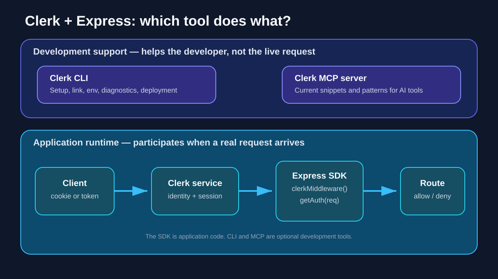
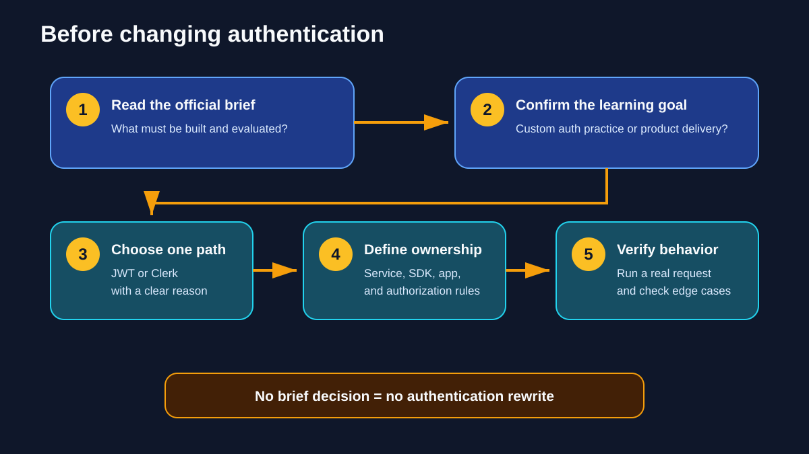

# 👻 `ghost ai` Project Review

> ✅ **Source review complete:** the accessible project conversation was inventoried and mapped to the Brief 2 Clerk lesson. The Clerk concept itself remains `Review needed` until the learner explains it.

## 🔎 Source checked

| Item | Verified value |
| --- | --- |
| ChatGPT project | `ghost ai` |
| Accessible project conversation | `Clerk CLI And MCP Explained` |
| Review date | 2026-10-09 |
| Repository destination | `workstreams/briefs/brief-2/` |

The current project inventory exposed one conversation belonging to `ghost ai`. Its readable learner questions covered Clerk, Clerk CLI, MCP, SDK, and Express.js.

## 🧠 Information captured

| Learner question | Repository answer | Status |
| --- | --- | --- |
| What is Clerk? | Authentication and user-management service | ✅ Documented |
| What is the Clerk CLI? | Optional terminal tool for setup, linking, environment management, diagnostics, and deployment support | ✅ Documented |
| What is Clerk's MCP server? | Optional development source of current Clerk snippets and patterns for compatible AI tools | ✅ Documented |
| What does SDK mean? | Software Development Kit: packages and helpers used by application code | ✅ Documented |
| What changes with Express.js? | Use the `@clerk/express` SDK and place `clerkMiddleware()` before routes that inspect authentication | ✅ Documented |
| Does the LMS project now use Clerk? | No. Clerk remains an investigated option until the official brief permits it | ✅ Boundary recorded |

## 🖼️ Visual coverage

### Application architecture

This chart makes the ownership boundary explicit: Clerk authenticates, Express applies business and authorization rules, and MongoDB stores application data.

### Tool and runtime boundaries

This exact architecture diagram shows that the CLI and MCP server support development, while the Clerk service and Express SDK participate in live authentication requests.

### Decision chart

This chart prevents an unverified authentication rewrite: read the brief, confirm the learning goal, choose one approach, define ownership, and test real behavior.

Both visuals are owned and tracked by the [Clerk authentication concept](../concepts/clerk-authentication/).

## 🛡️ Evidence boundary

The generated assistant messages in the source conversation were returned only as unavailable content references, so their wording was not copied or treated as evidence. Product details were checked against the official Clerk documentation linked in the concept lesson.

No Clerk dependency, key, configuration, or application code was added to the LMS project.

## 🎯 Next learning check

Explain which Clerk component belongs in the Express request path and why the CLI and MCP server are not runtime authentication code.
