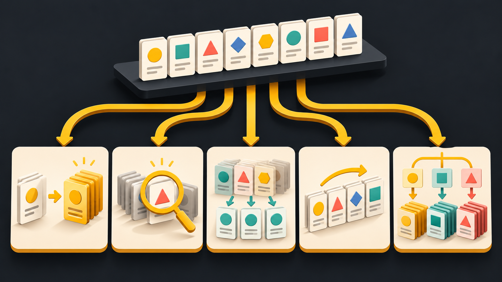
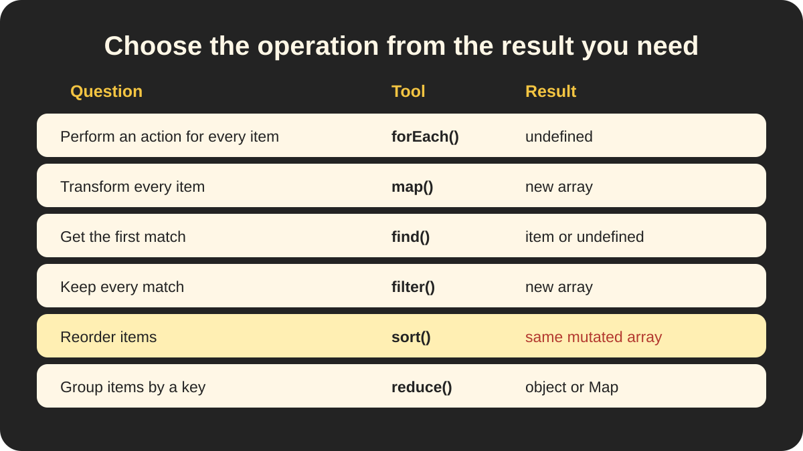

# 🧭 Data Operations — Traverse, Search, Filter, Sort, and Group

> 📍 **Workstream:** JavaScript Data Structures presentation

> 🧠 **Big idea:** The operation you choose depends on the result you need: one item, many items, a new order, transformed values, or categorized collections.

## 🖼️ Visual guide



One source collection can follow different paths. The correct path depends on whether the result should be one item, many items, reordered items, grouped items, or transformed values.



Start with the question in the left column, then confirm the method and its result. Notice that `sort()` is the mutating exception in this comparison.

## ⚡ Quick comparison

| Need | Common tool | Result |
| --- | --- | --- |
| Visit every item | `forEach()` | Performs an action; returns `undefined` |
| Transform every item | `map()` | A new array |
| Find the first match | `find()` | One element or `undefined` |
| Keep every match | `filter()` | A new array, possibly empty |
| Reorder items | `sort()` | The same mutated array |
| Put items into categories | Usually `reduce()` | A grouped object or `Map` |

## 🚶 Traverse and transform

`forEach()` visits every item to perform an action:

```js
courses.forEach(course => {
    console.log(course.title);
});
```

`map()` visits every item and creates a new array of transformed values:

```js
const titles = courses.map(course => course.title);
```

> Use `forEach()` for an action. Use `map()` when the transformed array matters.

## 🔍 Search and filter

```js
const firstBeginnerCourse = courses.find(
    course => course.level === "beginner"
);

const allBeginnerCourses = courses.filter(
    course => course.level === "beginner"
);
```

- `find()` returns the first complete matching element or `undefined`.
- `filter()` returns a new array containing all complete matching elements.
- An empty filtered result is `[]`, not `undefined`.

> **Search asks:** “Where is the first match?”
>
> **Filter asks:** “Which items match?”

## 🔃 Sort safely

Default `sort()` compares values like text and mutates the original array:

```js
const prices = [75, 20, 100];

prices.sort(); // [100, 20, 75]
```

Copy first and provide a numeric comparison function:

```js
const ascending = [...prices].sort((a, b) => a - b);
const descending = [...prices].sort((a, b) => b - a);
```

> ⚠️ **Common trap:** `sort()` changes the array on which it is called.

## 📦 Group related items

Grouping keeps all items but places them under shared keys:

```js
const groupedCourses = courses.reduce((groups, course) => {
    const category = course.category;

    groups[category] ??= [];
    groups[category].push(course);

    return groups;
}, {});
```

Possible result:

```js
{
    frontend: [reactCourse, vueCourse],
    backend: [expressCourse]
}
```

> **Grouping asks:** “Where does each item belong?”

## 🌐 Web culture

- Frontend code filters catalogue results and maps them into UI elements.
- Express controllers may find one record, filter permitted data, or group results before rendering a view.
- Sorting API data in place can unexpectedly change data reused elsewhere; copy first when the original order matters.
- Database queries can filter, sort, and group before data reaches JavaScript, so developers choose where each operation belongs.

## ✅ Quick summary

> **Traverse visits, search finds one, filter keeps matches, sort changes order, and grouping organizes by category.**

> ✅ **Remember:** decide the shape of the result you need before choosing the method.

See [the image tracker](images/README.md) for slide use, alt text, and generation details.
