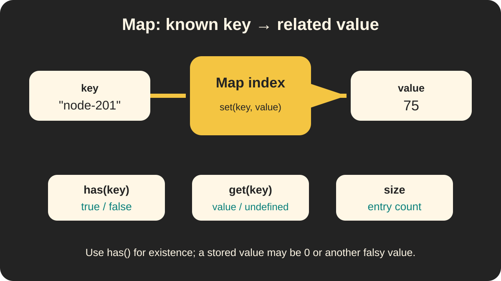

# 🗺️ Map — Key-Value Lookups

> 📍 **Workstream:** JavaScript Data Structures presentation

> 🧠 **Big idea:** Use a `Map` when one known key should lead directly to one related value.

## 🖼️ Visual guide


The middle index represents a `Map`: provide one exact key and it connects to the associated value without scanning an ordered display list.



The technical diagram separates `set()`, `get()`, `has()`, and `size`, so each method has one clear job.

## 🔑 Core methods

| Method or property | Purpose | Example result |
| --- | --- | --- |
| `set(key, value)` | Add or update an entry | Stores the value |
| `get(key)` | Retrieve the value | Value or `undefined` |
| `has(key)` | Check whether the key exists | `true` or `false` |
| `size` | Count the entries | A number |

```js
const progressByCourse = new Map();

progressByCourse.set("node-201", 75);

console.log(progressByCourse.get("node-201")); // 75
console.log(progressByCourse.has("node-201")); // true
console.log(progressByCourse.size);             // 1
```

## 🆚 Array or Map?

- Keep an `Array` when you need an ordered list to display, filter, or transform.
- Create a `Map` when you frequently retrieve a value using a known key.

```js
const progressList = [
    { courseId: "js-101", percent: 40 },
    { courseId: "node-201", percent: 75 }
];

const progressByCourse = new Map(
    progressList.map(item => [item.courseId, item.percent])
);
```

The array remains useful for displaying every course. The map becomes a lookup index for one course ID.

## ⚠️ `get()` is not `has()`

A stored value can be falsy:

```js
const progress = new Map([["js-101", 0]]);

progress.get("js-101"); // 0
progress.has("js-101"); // true
```

Use `has()` to test existence. A missing key makes `get()` return `undefined`.

## 🪪 Keys use type and identity

The number `1` and string `"1"` are different keys. Object keys must also be the exact same object reference.

```js
const learner = { id: 1 };
const results = new Map([[learner, 90]]);

results.get(learner);     // 90
results.get({ id: 1 });   // undefined: different object
```

When the real lookup value is an ID, using that primitive ID as the key is usually clearer:

```js
const resultsByLearnerId = new Map([[1, 90]]);

resultsByLearnerId.get(1);   // 90
resultsByLearnerId.get("1"); // undefined
```

## 🌐 Web culture

- Frontend applications may build a `Map` to find cached items by ID.
- Backend services may temporarily associate `courseId` with learner progress while processing data.
- JSON does not directly preserve a JavaScript `Map`; convert it to an array or plain object before sending it through an API.
- MongoDB documents usually arrive as objects or arrays, so a `Map` is often a useful in-memory lookup—not the original API format.

## ✅ Quick takeaway

> **Array for the list; Map for lookup by key.**

> ✅ **Remember:** `get()` retrieves a value, while `has()` checks whether the key exists.

See [the image tracker](images/README.md) for slide use, alt text, and generation details.
