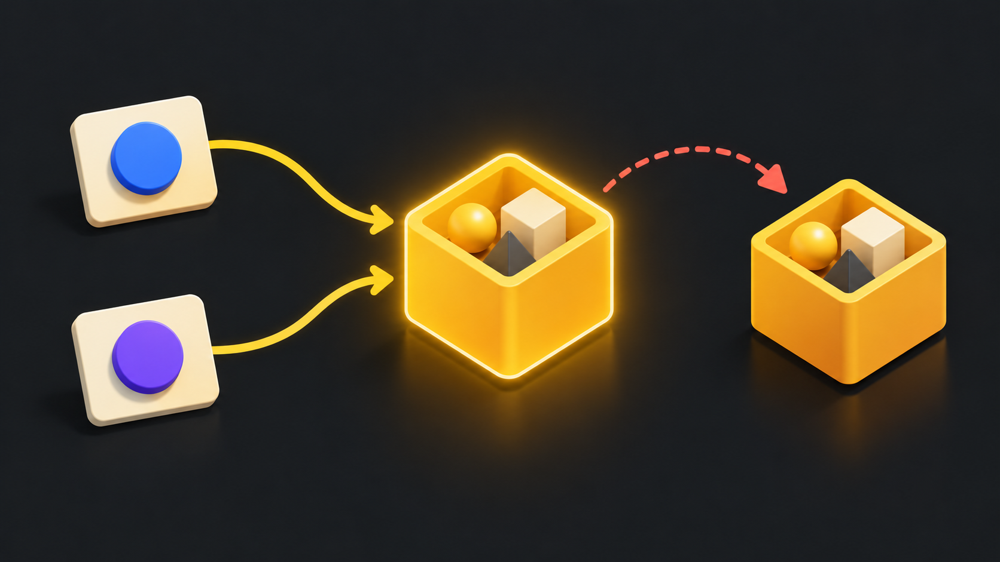
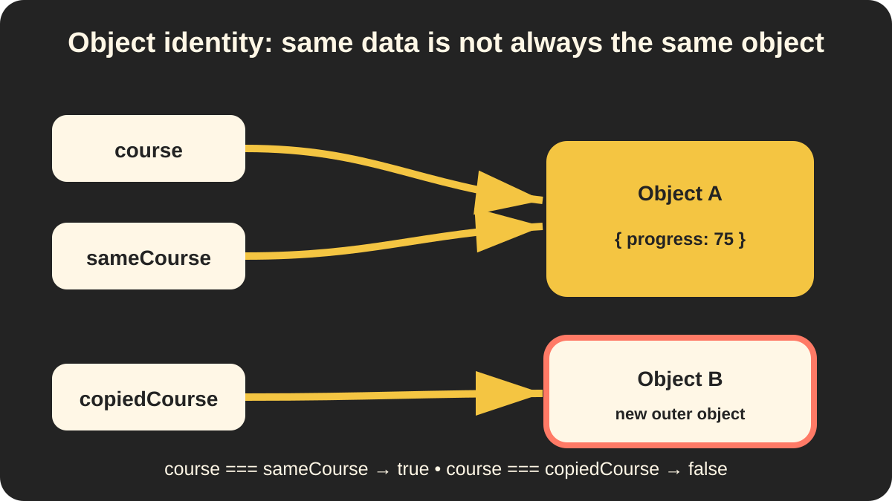
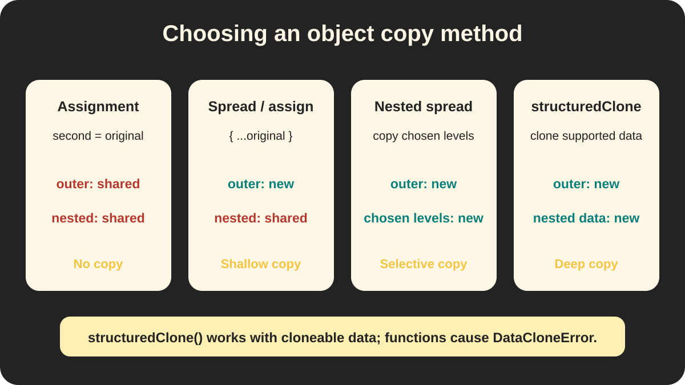

# Mutability, References, and Object Identity

> 📍 **Workstream:** JavaScript Data Structures presentation

> 🧠 **Big idea:** Two variables can share one object, so a change made through one variable can appear through the other.

## 🖼️ Visual guide



The two incoming paths represent variables that share one object. The separate box represents a copied outer object with a different identity.



Read each arrow as “stores a reference to.” Both `course` and `sameCourse` reach Object A, while `copiedCourse` reaches a different outer object.

## 🧊 Immutable and mutable values

- Numbers, strings, and Booleans are immutable. Operations create new values.
- Objects and arrays are mutable. Their properties or elements can change.

## 🔗 Shared references

A variable holding an object contains a reference. Assigning it to another variable copies the reference, not the object.

```js
const course = { progress: 20 };
const sameCourse = course;

sameCourse.progress = 75;
console.log(course.progress); // 75
```

## 🪪 Identity and `const`

- `const` prevents variable reassignment; it does not freeze the object.
- `===` checks object identity, not matching property values.
- Two variables are equal only when they reference the exact same object.

```js
const copiedCourse = { ...course };

console.log(course === sameCourse);  // true
console.log(course === copiedCourse); // false
```

## 📦 Shallow copy

`{ ...course }` creates a new outer object, but nested objects can remain shared.

## 🪆 Copying a nested object

Copy every nested level that must change independently:

```js
const original = {
    trainer: {
        name: "Sara"
    }
};

const safeCopy = {
    ...original,
    trainer: {
        ...original.trainer
    }
};

safeCopy.trainer.name = "Ali";

console.log(original.trainer.name); // "Sara"
console.log(safeCopy.trainer.name); // "Ali"
console.log(original.trainer === safeCopy.trainer); // false
```

The later `trainer` property replaces the shared reference created by `...original`.

## 🧬 Deep copy with `structuredClone()`

When the data has several nested levels, manually spreading every level can become repetitive. `structuredClone()` creates a deep copy of data supported by the structured clone algorithm:

```js
const original = {
    trainer: {
        name: "Sara"
    },
    topics: ["objects"]
};

const deepCopy = structuredClone(original);

deepCopy.trainer.name = "Ali";
deepCopy.topics.push("arrays");

console.log(original.trainer.name); // "Sara"
console.log(original.topics);       // ["objects"]
console.log(original.trainer === deepCopy.trainer); // false
```

The outer object, nested object, and nested array are separate in the copy.



Use the diagram from left to right:

- Assignment creates another reference to the same object.
- Spread syntax and `Object.assign({}, original)` create a new outer object but keep nested references shared.
- Manual nested spread copies only the levels you explicitly rebuild.
- `structuredClone(original)` deeply copies supported data.

## 🧭 Which copy method should I choose?

| Need | Method | Important detail |
| --- | --- | --- |
| Share the same object intentionally | `const second = original` | This is not a copy. |
| Copy a flat object | `{ ...original }` or `Object.assign({}, original)` | Both are shallow copies. |
| Copy only a few known nested levels | Nested spread syntax | You choose exactly which levels become independent. |
| Copy nested cloneable data | `structuredClone(original)` | Nested objects and arrays become independent. |

> ⚠️ **Limit:** `structuredClone()` is for structured-cloneable data, not every JavaScript value. A function inside the value causes a `DataCloneError`. Do not use it blindly on live framework objects; first select the plain data the application needs.

The older `JSON.parse(JSON.stringify(value))` trick is not a general replacement. JSON can change or lose values such as `Date`, `undefined`, `Map`, and `Set`, and it cannot handle every object shape safely.

Official references: [MDN `structuredClone()`](https://developer.mozilla.org/en-US/docs/Web/API/Window/structuredClone), [MDN `Object.assign()`](https://developer.mozilla.org/en-US/docs/Web/JavaScript/Reference/Global_Objects/Object/assign), and the [HTML structured-clone specification](https://html.spec.whatwg.org/multipage/structured-data.html#structured-cloning-api).

## 🧪 Understanding check — review needed

Predict the three outputs before running the code:

```js
const course = {
    trainer: { name: "Sara" },
    lessons: ["objects"]
};

const copiedCourse = structuredClone(course);
copiedCourse.trainer.name = "Ali";
copiedCourse.lessons.push("arrays");

console.log(course.trainer.name);
console.log(course.lessons);
console.log(course.trainer === copiedCourse.trainer);
```

> 🔁 This new subtopic remains **Review needed** until the learner predicts the output and explains why the nested values are independent.

## ⚠️ Common trap

Object spread copies only one level. It is not an automatic deep clone.

## 🌐 Web culture

- React updates are easier to detect when state is replaced instead of directly mutated.
- Express middleware can modify a shared request object that later middleware receives.
- Mongoose documents are mutable objects that track changes before `save()`.
- JSON sent over HTTP does not preserve object identity, shared references, or methods.
- `structuredClone()` is useful for plain nested data, but application code should usually copy only the data it actually needs.

> ✅ **Remember:** use nested spread for selected levels and `structuredClone()` for supported nested data that must become fully independent.

See [the image tracker](images/README.md) for slide use, alt text, and generation details.
