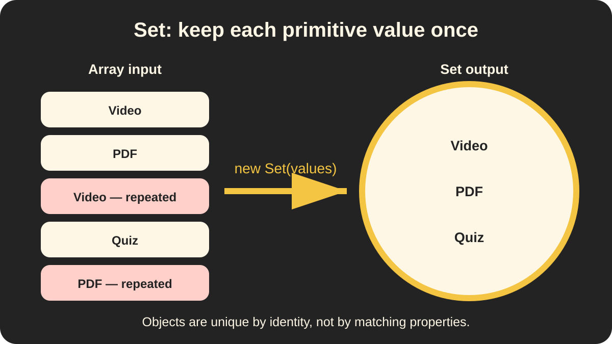

# 🧺 Set — Unique Values

> 📍 **Workstream:** JavaScript Data Structures presentation

> 🧠 **Big idea:** A `Set` stores each value only once.

## 🖼️ Visual guide


Repeated tokens arrive from the left, while the collection on the right keeps only one token of each shape and color.



The exact example shows five category entries becoming three unique primitive values. Objects still follow identity rules.

## ✨ Removing duplicates

```js
const categories = [
    "Video",
    "PDF",
    "Video",
    "Quiz",
    "PDF"
];

const uniqueCategories = new Set(categories);

console.log(uniqueCategories.size);         // 3
console.log(uniqueCategories.has("Video")); // true
console.log([...uniqueCategories]);          // ["Video", "PDF", "Quiz"]
```

The `Set` ignores repeated values and preserves the order of their first appearance.

## 🧰 What we used

| Syntax | Purpose |
| --- | --- |
| `new Set(values)` | Create a set from iterable values |
| `set.size` | Count its unique values |
| `set.has(value)` | Check whether a value exists |
| `[...set]` | Convert the set back into an array |

## 🪪 Objects use identity

Two separate objects remain separate values, even when their properties match:

```js
const tagA = { name: "JavaScript" };
const tagB = { name: "JavaScript" };

const tags = new Set([tagA, tagB]);

console.log(tags.size); // 2
```

But adding the same object reference twice produces one entry:

```js
const tag = { name: "JavaScript" };
const tags = new Set([tag, tag]);

console.log(tags.size);    // 1
console.log(tags.has(tag)); // true
```

## ⚠️ Common trap

A `Set` does not compare object properties. It compares object identity.

```js
new Set([
    { id: 1 },
    { id: 1 }
]).size; // 2
```

For simple duplicate removal, store primitive values such as category names, tags, or IDs.

## 🌐 Web culture

- Use a `Set` to extract unique tags or categories from API results.
- Use it to track selected IDs without adding the same ID twice.
- Convert it to an array before sending JSON because JSON does not directly preserve a JavaScript `Set`.
- When objects must be unique by `id`, compare or store the IDs instead of relying on matching object properties.

## ✅ Quick takeaway

> **Set is the right choice when the important rule is: no duplicate values.**

## 🧭 Quick choice

| Need | Structure |
| --- | --- |
| Display an ordered course catalogue | `Array` |
| Retrieve progress by `courseId` | `Map` |
| Extract unique resource categories | `Set` |

> ✅ **Remember:** `Set` keeps unique primitives by value and unique objects by identity.

See [the image tracker](images/README.md) for slide use, alt text, and generation details.
