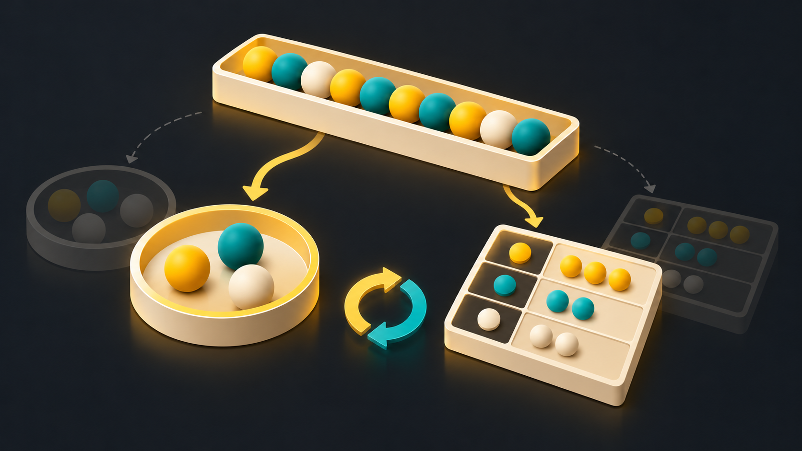
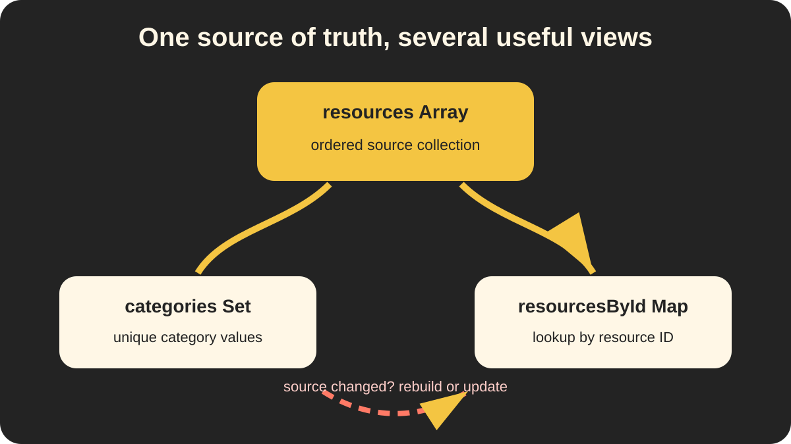

# 🧱 Source Data and Derived Structures

> 📍 **Workstream:** JavaScript Data Structures presentation

> 🧠 **Big idea:** Keep one clear source of truth, then derive other structures for specific operations.

## 🖼️ Visual guide



The ordered tray is the source array. The round collection represents unique values in a `Set`, and the grid represents keyed entries in a `Map`. The refresh symbol warns that derived snapshots must be rebuilt or updated.



The array remains the source of truth. The `Set` and `Map` are separate containers created for unique values and lookup by ID.

## 📚 One source, different views

```js
const resources = [
    { id: 1, title: "Introduction", category: "Video" },
    { id: 2, title: "Variables", category: "PDF" },
    { id: 3, title: "Functions", category: "Video" }
];
```

The array is useful for displaying the resources in order. We can derive other structures from it:

```js
const categories = new Set(
    resources.map(resource => resource.category)
);

const resourcesById = new Map(
    resources.map(resource => [resource.id, resource])
);
```

| Structure | Role |
| --- | --- |
| `resources` array | Ordered source collection |
| `categories` set | Unique category values |
| `resourcesById` map | Resource lookup by ID |

## 📸 Derived structures are snapshots

Changing the source array does not automatically update an existing `Map` or `Set`:

```js
resources.push({
    id: 4,
    title: "Objects",
    category: "Article"
});

console.log(resourcesById.has(4)); // false
```

The map was created before resource `4` existed.

## 🔄 Keeping derived data current

Choose one clear strategy:

1. Rebuild the derived structure after the source changes.
2. Update the source and its lookup structure together.
3. Derive the structure only when it is needed.

```js
const currentResourcesById = new Map(
    resources.map(resource => [resource.id, resource])
);

console.log(currentResourcesById.has(4)); // true
```

## ⚠️ Common trap

Treating two separate structures as if they update each other automatically creates stale data and difficult bugs.

> One object reference can be shared, but an array and a map built from that array are still separate containers.

## 🌉 API boundary

JavaScript `Map` and `Set` values are useful while processing data, but JSON does not serialize their entries directly:

```js
JSON.stringify(new Map([["js-101", 75]])); // "{}"
JSON.stringify(new Set(["JavaScript"]));   // "{}"
```

Convert them before sending an API response:

```js
Object.fromEntries(resourcesById);
[...categories];
```

## 🌐 Web culture

- MongoDB and APIs commonly provide arrays of objects as source data.
- Controllers may derive a `Map` for repeated lookup or a `Set` for unique values.
- Frontend components often derive filtered, sorted, or grouped views from one original collection.
- Keeping multiple editable copies of the same information can create synchronization bugs.

## ✅ Quick takeaway

> **One source of truth can produce several structures, but derived structures must be rebuilt or updated when the source changes.**

> ✅ **Remember:** transformations create new containers; they do not create automatic synchronization.

See [the image tracker](images/README.md) for slide use, alt text, and generation details.
