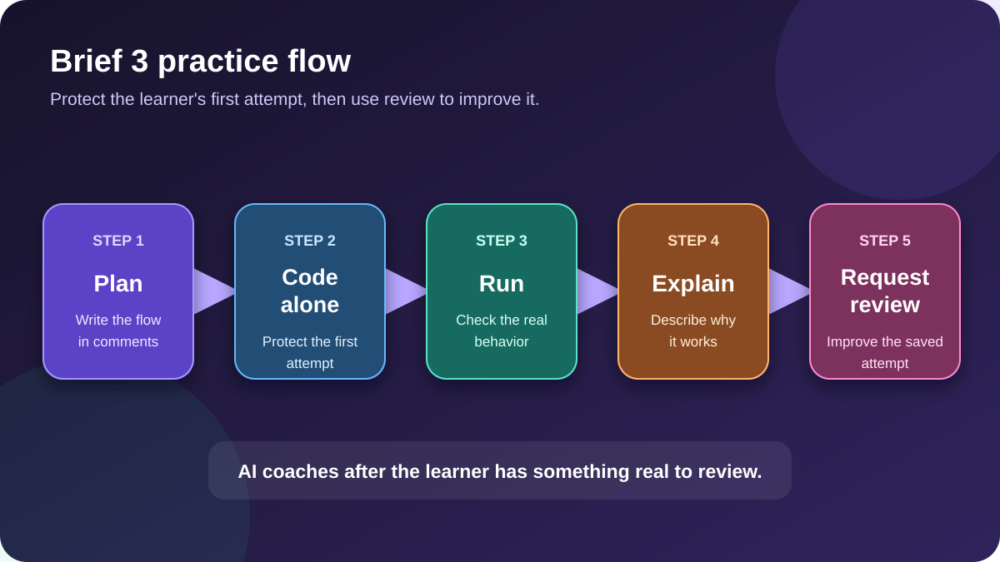

# 🔎 Brief 3 Analysis

> ✅ **Evidence-based review:** this analysis uses the saved mentor evaluation. It does not claim to reproduce the missing original brief.

## 🧠 Big idea

- The technical foundation was validated.
- The next improvement comes from repetition, syntax fluency, and clearer explanations—not from adding more complicated tools.

## ✅ Validated strengths

- MVC responsibilities were separated clearly.
- The controller used a class and stored hotel data with `this.hotels`.
- Express routes, dynamic parameters, array filtering, and EJS rendering were understood functionally.
- Repository patterns, interfaces, contracts, and Sequelize were part of the demonstrated foundation.
- Planning the controller, route, view, and dynamic route in comments before coding was a strong habit.

## 🎯 Improvement points

- Practise Express and EJS syntax without generative AI.
- Repeat city, star-count, and amenity filters.
- Write a simple raw SQL `JOIN` without Sequelize.
- Explain the request flow and technical decisions in three minutes.

## 🔄 Practice dependency flow

The diagram shows the learning order: plan first, code independently, run the behavior, explain the flow, and only then request review. The surrounding text and verified program output remain the source of truth.

## ⚠️ Main risk

- Letting AI write the first attempt would hide the exact syntax gaps that the practice is meant to reveal.

## 🌐 Web culture

- Professional developers often sketch the request flow before coding.
- They verify behavior before presenting it as complete.
- They use reviews to improve an existing attempt, not to replace the attempt.

## 🔗 Evidence

- [Full mentor evaluation](../feedback/mentor-evaluation.md)
- [Improvement exercises](../exercises/)

> ✅ **Remember:** plan → code alone → run → explain → review.
