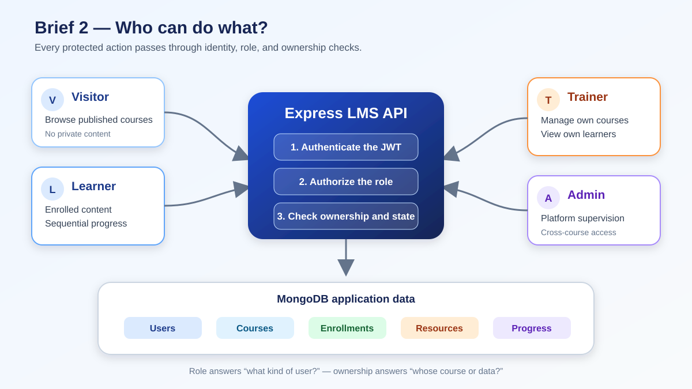
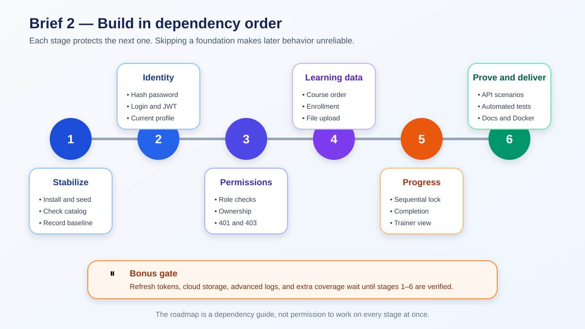

# 📋 Sprint 2 Brief Analysis

> 🟡 **Status:** the requirements and current code baseline are mapped. Runtime verification is still required before feature work.

## 🎯 Brief goal

Take over the existing LMS API without regression, secure it for learners, trainers, and administrators, and add the backend learning flow: course ownership, enrollment, protected resources, strict sequential progress, trainer reporting, tests, documentation, and a reproducible runtime.

## 💡 The brief in plain language

This brief asks the team to turn an existing **public course catalog** into the backend of a real learning platform.

The work has four connected ideas:

1. **Know the user:** registration, login, password hashing, JWT, and account status.
2. **Control access:** roles decide the general permission; ownership decides whether a trainer may access this specific course.
3. **Control the learning journey:** enrollment gives access, ordered modules define the path, and backend progress rules decide what unlocks next.
4. **Prove the behavior:** tests, API documentation, Git review, and Docker make the result repeatable and reviewable.

## 🗺️ Big-picture scope



The four role cards show **who is making the request**. The center shows the three decisions the API makes before protected data is returned:

1. Is the JWT valid?
2. Does this role allow the action?
3. Does this user own or have access to this course and its data?

The database row shows the main information those decisions protect. Exact endpoint behavior remains defined by the [supplied brief](../brief-content/).

## ✅ Confirmed boundaries

| Area | Confirmed requirement |
| --- | --- |
| Dates | Start 2026-10-05; deadline 2026-10-16 |
| Team | Binôme; Mehdi and Maroua |
| Stack | Node.js, Express, MongoDB, and Mongoose |
| Authentication | bcrypt or bcryptjs plus JWT with `jsonwebtoken` |
| Roles | `learner`, `trainer`, and `admin`; public registration always creates a learner |
| Content | Trainer-owned courses with ordered modules and associated resources |
| Upload | Real, controlled local upload or an equivalent documented solution |
| Enrollment | Many courses per learner; only one active enrollment for the same learner-course pair |
| Progress | Strict backend-controlled sequence with accessible, locked, in-progress, and completed states |
| Verification | Postman or Insomnia scenarios plus focused automated tests |
| Documentation | Swagger/OpenAPI or equivalent, README, `.env.example`, and known limitations |
| Runtime | Dockerfile or Docker API plus MongoDB |
| Collaboration | Named tickets, visible individual contributions, stable `main`, focused PRs, and teammate review |

## 🔎 Current API baseline

This is a read-only code inspection, not runtime proof.

### Already present

- Express server with separate models, controllers, routes, middleware, and Swagger configuration.
- Mongoose models for `User`, `Course`, `Module`, `Resource`, and `Enrollment`.
- Public registration with a server-owned learner role and bcrypt hashing.
- Login code with hidden-password selection, `bcrypt.compare()`, suspended-account rejection, and JWT signing.
- Published-course listing, course detail, ordered module listing, and ordered resource listing.
- A basic enrollment controller.
- Partial Swagger documentation, `.env.example`, Dockerfile, and Docker Compose with MongoDB.

### Needs verification or correction

- The saved login and login schema need behavior checks before they can be marked complete.
- No authentication or role-authorization middleware was found in the inspected files.
- The enrollment route expects `req.user.id`, but the inspected route does not attach an authenticated user first.
- `Enrollment` has no database-level rule preventing duplicate active learner-course pairs.
- Courses do not yet record trainer ownership.
- Course, module, and resource management endpoints are incomplete.
- Resource upload is not implemented; Multer is not listed as a dependency.
- No progress model or sequential-locking flow was found.
- No trainer reporting endpoints or ownership checks were found.
- No focused automated test setup was found in `package.json`.
- Swagger covers only part of the API, and the root README is still empty.

## ⚠️ Highest-risk rules

1. **Authentication before enrollment:** `req.user` must come from a verified token, never from client-supplied identity.
2. **Role plus ownership:** being a trainer is insufficient; the trainer must own the course unless the requester is an admin.
3. **Database-backed uniqueness:** an application-level duplicate check alone can fail under concurrent requests.
4. **Sequential progress:** the server must derive access from stored completion state, not trust a client-provided percentage or unlocked flag.
5. **Upload safety:** file type, size, generated filename, storage path, module linkage, and download authorization all need controls.
6. **Regression safety:** catalog routes and seed data must still work after private LMS behavior is added.

## 🧩 Dependency order



Read the roadmap from left to right. Progress cannot be trusted before enrollment, ordering, authentication, and permissions are coherent. Tests and documentation appear at the end as a delivery stage, but small tests and documentation updates should still accompany each earlier feature.

```text
Stable API baseline
  -> response and error contracts
  -> password login
  -> JWT authentication
  -> roles and ownership
  -> coherent course/module/resource models
  -> enrollment invariant
  -> protected uploads
  -> sequential progress
  -> trainer reporting
  -> critical scenario tests
  -> complete documentation and reproducible runtime
```

## 🚦 Priority guide

| Priority | Meaning | Examples |
| --- | --- | --- |
| 🔴 Mandatory foundation | Required for the brief to succeed | JWT, roles, ownership, enrollment uniqueness, uploads, sequential progress, critical tests |
| 🟠 Recommended after stability | Useful when the mandatory foundation works | Archiving, reordering endpoints, trainer status filters |
| 🟢 Bonus or postponable | Start only when required behavior is verified | Refresh tokens, cloud storage, advanced logs, advanced pagination |

This separation protects the deadline: a working secure learning flow is more valuable than several unfinished bonus features.

## 🛠️ Delivery obligations

- Record the preserved, modified, removed, and postponed endpoints.
- Keep regression fixes separate from new features.
- Justify implementation-driven differences from the Brief 1 UML.
- Keep Jira tickets, individual ownership, branches or forks, PRs, reviews, README, and known limitations current.
- Treat refresh tokens, advanced Zod coverage, progress summary endpoints, cloud storage, expanded coverage, structured logs, and advanced pagination as bonuses only after the mandatory foundation is verified.

## 🎯 First checkpoint

Complete the short non-regression scenario and explain why one existing route must be checked before and after a feature change. Full baseline verification comes later as project work.
