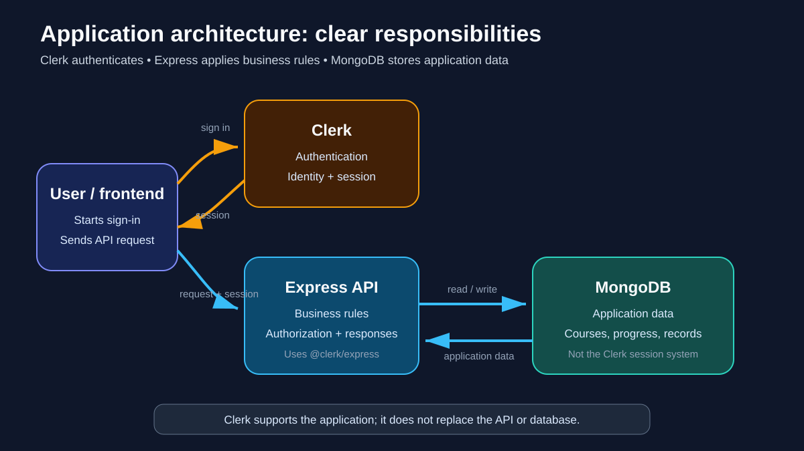
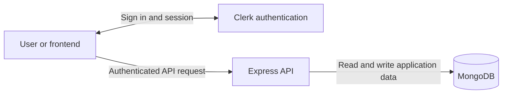
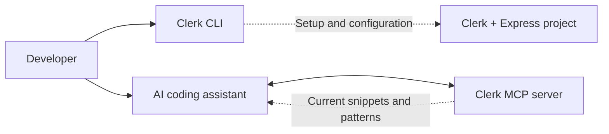

# 🔐 Clerk Authentication Tools

> 🔁 **Review needed:** the concept was discussed and documented, but it is not yet a project decision or a verified implementation.

> 📖 Review the concise [book foundation → MERN note](../../notes/clerk-authentication.md) before the understanding check.

## 💬 Conversation source

This lesson tracks the accessible questions from the ChatGPT project **`ghost ai`**, conversation **`Clerk CLI And MCP Explained`**:

- What are Clerk, the Clerk CLI, and MCP?
- Why could they matter for the project?
- What does SDK stand for?
- How does the answer change when the backend uses Express.js?

The conversation's generated answers were not available as readable text during the repository review. The technical explanations below were therefore checked against Clerk's official documentation instead of treating unavailable chat content as verified evidence. See the [source review](../../notes/ghost-ai-project-review.md) for the complete mapping.

## 🧠 Big idea

**Clerk** is an authentication and user-management service. It can handle sign-up, sign-in, sessions, and user identity so an application does not have to build every authentication feature from scratch.

## 1. 🏗️ Application architecture

> **Important:** Clerk does not replace Express or MongoDB. Clerk handles authentication, Express implements business rules, and MongoDB stores the application's data.





| Part | Main responsibility | Example |
| --- | --- | --- |
| Clerk | Prove who the user is and manage the session | Sign-in, user identity, session token |
| Express | Apply the application's business and authorization rules | Validate a request, check ownership, return an API response |
| MongoDB | Store data owned by the application | Courses, enrollments, progress, and domain records |

Clerk answers **“Who is making this request?”** Express still decides **“What is this user allowed to do?”** MongoDB stores the data used to make and persist that decision.

## 2. 🧰 Where CLI and MCP fit


> 🖼️ The upper lane contains development tools. The lower lane contains the live application path. User requests do not pass through the CLI or MCP server.



The related names describe different jobs:

| Name | Meaning | Where it is used | Required? |
| --- | --- | --- | --- |
| Clerk | The authentication service and hosted user system | Outside and alongside the application | Only if the project chooses Clerk |
| SDK | **Software Development Kit**: packages and helpers used by application code | Inside the frontend or backend code | Yes, when integrating Clerk |
| Clerk CLI | A terminal tool for setup, project linking, environment management, diagnostics, and deployment support | During development | Optional convenience |
| Clerk MCP server | A source of current Clerk snippets and patterns for compatible AI coding assistants | In the AI development tool | Optional development help |

The CLI and MCP server do **not** authenticate users in the production request path. The SDK integration does that work.

## 🌐 Express.js connection

For an Express backend, Clerk provides the `@clerk/express` SDK. Its `clerkMiddleware()` reads session information from request cookies or headers and makes authentication state available to later route handlers. A route can then use `getAuth(req)` to decide whether the request is authenticated and authorized.

```js
import express from "express";
import { clerkMiddleware, getAuth } from "@clerk/express";

const app = express();

app.use(clerkMiddleware());

app.get("/profile", (req, res) => {
  const auth = getAuth(req);

  if (!auth.isAuthenticated) {
    return res.status(401).json({ message: "Unauthorized" });
  }

  return res.json({ userId: auth.userId });
});
```

This is a learning example only. It was not added to the LMS project.

## 🧰 Development tools

The Clerk CLI can install the correct SDK, link a local project to a Clerk application, pull environment variables, run diagnostics, and help configure Clerk's MCP server. Its current Express support installs the SDK, but does not provide the same full scaffolding available for every supported framework.

Clerk's MCP server gives an AI assistant current SDK snippets and implementation patterns. It helps the assistant answer Clerk questions; it does not replace the Clerk service, application SDK, project requirements, tests, or developer understanding.

## 🧭 Project decision


Before changing the LMS project:

1. Read the official brief requirement.
2. Confirm whether authentication must be built manually for learning and evaluation.
3. Choose either the current Zod + bcrypt + JWT path or an approved Clerk integration.
4. Avoid mixing both approaches without a clear reason and ownership boundary.
5. Implement one small flow and verify its real request behavior.

The repository currently tracks a learner-built `POST /api/auth/login` flow. Clerk remains an investigated alternative, not the selected implementation.

## ⚠️ Common traps

- Installing the CLI is not the same as integrating Clerk into Express.
- Connecting the MCP server is not proof that authentication works.
- A hosted authentication service does not remove the need for application authorization rules.
- Do not put secret keys in source code or commit environment files.
- Do not replace a required learning exercise with a service before checking the brief.

## ✅ Understanding check

Explain these in your own words before this concept becomes complete:

1. Which Clerk tool is used by the running Express application?
2. Which two tools only help during development?
3. Why must we check the official brief before replacing the custom JWT flow?

## 🔗 Official sources

- [Clerk Express SDK overview](https://clerk.com/docs/reference/express/overview)
- [`clerkMiddleware()` reference](https://clerk.com/docs/reference/express/clerk-middleware)
- [Clerk CLI guide](https://clerk.com/docs/cli)
- [Clerk MCP server guide](https://clerk.com/docs/guides/ai/mcp/clerk-mcp-server)

> 💡 **Remember:** the SDK runs with the app; the CLI and MCP server help you build the app.
