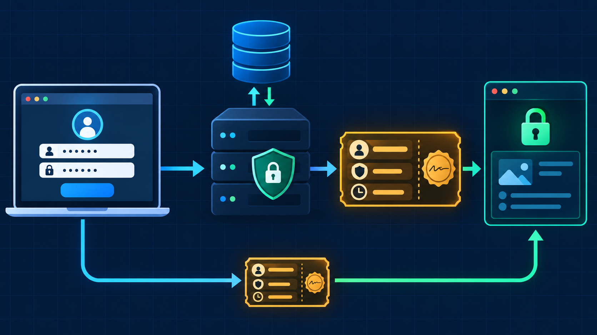
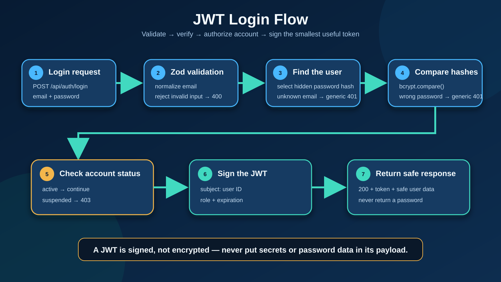
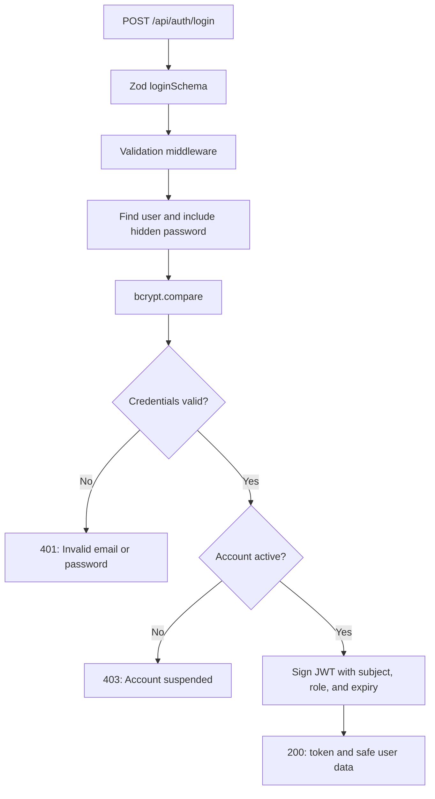

# 🔐 JWT Authentication

> 🔁 **Review needed:** the verification middleware passed isolated token checks, but it is not connected to a protected route and the learner review is pending.

> 📖 Review the concise [book foundation → MERN note](../../notes/jwt-authentication.md) before continuing the implementation.

> 🖼️ The illustration makes the full journey memorable. Exact technical details remain in the reviewed diagrams and text below. See the [image tracker](./images/).

## 🧠 Big idea

A JWT is created **after** the server verifies a user's credentials. The client then sends that token with later requests so the API can identify the user.

A JWT is **signed**, not encrypted. Its payload can be read, so it must never contain a password, password hash, or secret.

## 🔄 Planned login flow

## ✅ Verified foundation

- `jsonwebtoken@9.0.3` is installed in the LMS project.
- `.env.example` contains safe `JWT_SECRET` and `JWT_EXPIRES_IN` placeholders.
- The private JWT secret exists, has a strong length, and is not displayed or committed.
- The JWT expiration is configured.
- `.env` is ignored by Git.
- The separate login schema normalizes email, rejects unexpected fields, and requires a non-empty password.
- The authentication middleware reads and validates the `Bearer <token>` header shape.
- `jwt.verify()` checks the token with `JWT_SECRET` and exposes the signed subject as `decoded.sub`.
- A successful check creates `req.user` with the verified `id` and `role`, then calls `next()`.
- Final isolated checks passed for valid, expired, and invalid tokens.

## 🛠️ How to use this skill

Use the checklist as an implementation order, not as proof of completion. Each step still requires saved code, behavior checks, and a learner explanation.

## 🔁 Current review point

Review the complete [`jwt.verify()` middleware notes](../../notes/jwt-authentication.md), then explain:

- why `decoded.sub` becomes trustworthy only after verification;
- why every error response uses `return`;
- why `next()` runs only after `req.user` is created.

## ⬜ Still to demonstrate

- Find a user while explicitly selecting the hidden password.
- Compare the submitted password with `bcrypt.compare()`.
- Return the same `401` response for an unknown email and a wrong password.
- Reject a suspended account with `403`.
- Sign a token containing only the user ID, role, and expiration.
- Verify the returned token and confirm the response contains no password.
- Exercise the missing-header and malformed-header branches with behavior checks.
- Connect the middleware to `GET /api/auth/me` or another protected route.
- Protect routes by authentication, role, and resource ownership.

## ⚠️ Common traps

- Do not generate a new JWT secret on every request or restart. Existing tokens would immediately become invalid.
- Do not put confidential data in the token payload.
- Do not reveal whether an email exists through different login error messages.
- Do not reuse registration password policy as credential verification logic. Login only needs a non-empty submitted password before comparison.

## 🌐 Web culture

Production APIs keep secrets in environment configuration, use short-lived access tokens, return generic credential errors, and separate authentication from authorization. Authentication answers **who are you?** Authorization answers **what are you allowed to do?**

> ✅ **Remember:** validate input, verify credentials, check account status, then sign the smallest useful token.
