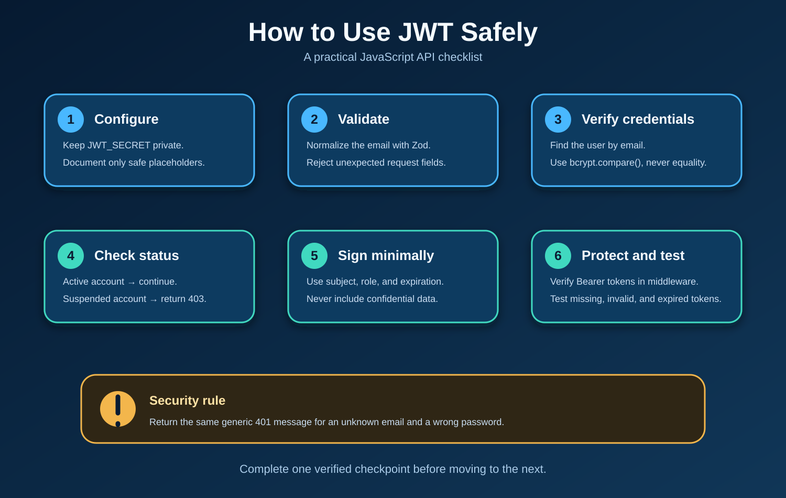

# 🔐 `jwt.verify()` — Quick Review

> 🔁 **Review needed** — the middleware works in isolated checks, but it still needs to be connected to a protected route.

> 🧠 **Big idea:** `jwt.verify()` checks whether a token is authentic and still valid before the API trusts its data.



The visual shows the complete JWT journey. This note focuses on the final step: verifying the token inside Express middleware.

## 🔄 The middleware flow

1. Read `req.headers.authorization`.
2. Extract the token from `Bearer <token>`.
3. Verify it with `JWT_SECRET`.
4. Save the trusted identity in `req.user`.
5. Call `next()` when the token is valid.
6. Return `401` when the token is missing, invalid, or expired.

```js
const decoded = jwt.verify(token, process.env.JWT_SECRET);

req.user = {
  id: decoded.sub,
  role: decoded.role,
};

next();
```

## 🧩 Important pieces

| Code | Meaning |
| --- | --- |
| `Bearer` | The authentication scheme before the token |
| `jwt.verify()` | Checks the signature and expiration |
| `decoded.sub` | The user ID stored as the token subject |
| `req.user` | The verified identity shared with later middleware and controllers |
| `next()` | Continues the request after authentication succeeds |
| `return res.status(401)` | Sends the error response and stops that branch |

## 🧭 Expected results

| Request | Result |
| --- | --- |
| No header | `401` |
| Wrong Bearer format | `401` |
| Invalid token | `401` |
| Expired token | `401` |
| Valid token | Create `req.user`, then call `next()` |

## ⚠️ Common traps

- Use `req.headers.authorization`, not `req.header.authorization`.
- Compare `scheme` with `"Bearer"`, not with the token.
- Use `JWT_SECRET`, not `JTW_SECRET`.
- `status: 401` in JSON does not set the HTTP status. Use `res.status(401)`.
- Use `return` after an error response to prevent a second response.
- A valid token still needs `next()`, or the request remains stuck.
- Decoding a token is not the same as verifying it.

## 📖 Eloquent JavaScript foundation

- **Chapter 10, pages 172–176:** modules and NPM packages support importing `jsonwebtoken` and exporting middleware.
- **Chapter 18, pages 317–322:** HTTP requests contain headers, and responses use real status codes.
- **Chapter 20, pages 361–369:** Node.js handles incoming requests and outgoing responses.
- The book does not teach JWT directly; JWT applies these JavaScript, HTTP, module, and Node.js foundations.

## 🧩 MERN connection

- **Express:** runs the middleware before a protected controller.
- **Node.js:** executes `jwt.verify()` on the server.
- **MongoDB:** can load the current user after the token identifies them.
- **React:** sends the token in the `Authorization` header.

## 🌐 Web culture

- APIs commonly use `Authorization: Bearer <token>`.
- Authentication asks: **Who are you?**
- Authorization asks: **What are you allowed to do?**
- Never place passwords, password hashes, or secrets inside a JWT payload.

## ✅ Verified so far

- The final middleware passed its syntax check.
- Valid, expired, and invalid-token behavior passed isolated checks.

## ⬜ Still to verify

- Missing-header behavior through a real request.
- Malformed Bearer-header behavior through a real request.
- Connection to `GET /api/auth/me` or another protected route.
- The learner explanation and review questions below.

## 🧪 Review later

1. Why can the API trust `decoded.sub` only after `jwt.verify()` succeeds?
2. Why do error responses use `return`?
3. What does `next()` do after authentication succeeds?

## 🔗 Continue learning

- [Detailed JWT lesson and visual pack](../concepts/jwt-authentication/)
- [Local Eloquent JavaScript book](../../../../../../Eloquent_JavaScript.pdf)

> ✅ **Remember:** read the token, verify it, attach the identity, then continue.
